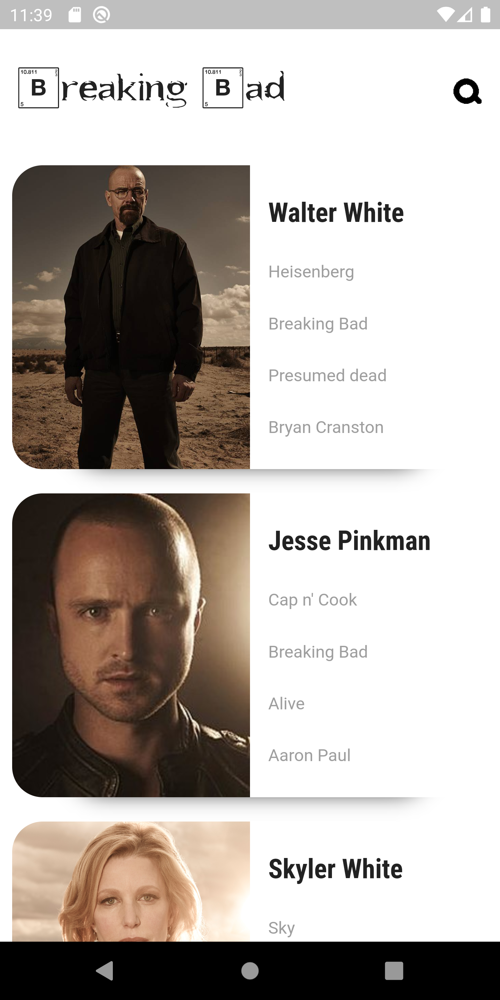

# Flutter Breaking Bad

# Usage:

```bash
 cd flutter_breaking_bad

 flutter pub get

 flutter pub run build_runner build --delete-conflicting-outputs

 flutter run

```



## Data by https://breakingbadapi.com/

## Layout Inspiration (UI) https://dribbble.com/shots/4985712-Marvel-Heroes-Library
